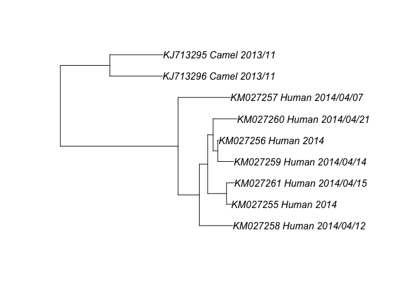
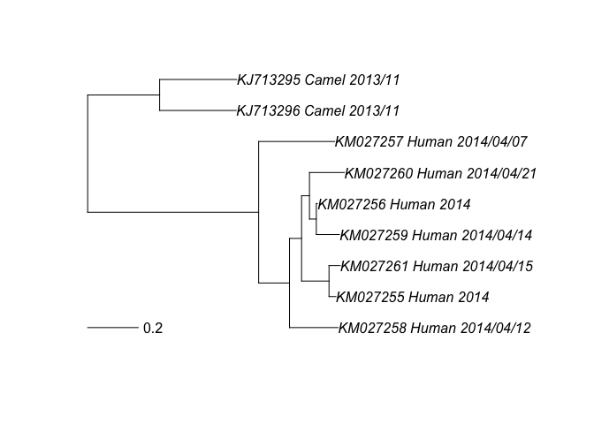

Practice
========

Load libraries
--------------

    library(ape)
    library(ggplot2)
    library(ggtree)
    library(phylobase)

    ## 
    ## Attaching package: 'phylobase'
    ## 
    ## The following object is masked from 'package:ape':
    ## 
    ##     edges

Read in tree
------------

`read.tree` is used to read in a Newick formatted tree.

    tr <- read.tree("mers_subtree.tre")
    tr

    ## 
    ## Phylogenetic tree with 9 tips and 8 internal nodes.
    ## 
    ## Tip labels:
    ##  KM027258_Human_2014/04/12, KM027255_Human_2014, KM027261_Human_2014/04/15, KM027259_Human_2014/04/14, KM027256_Human_2014, KM027260_Human_2014/04/21, ...
    ## Node labels:
    ##  1.0, 1.0, 0.9876111111111111, 0.1333888888888889, 0.9997222222222222, 0.1065, ...
    ## 
    ## Rooted; includes branch lengths.

Let's look closer at the tree object.

    names(tr)

    ## [1] "edge"        "Nnode"       "tip.label"   "edge.length" "node.label"

    tr$edge

    ##       [,1] [,2]
    ##  [1,]   10   11
    ##  [2,]   11   12
    ##  [3,]   12    1
    ##  [4,]   12   13
    ##  [5,]   13   14
    ##  [6,]   14    2
    ##  [7,]   14    3
    ##  [8,]   13   15
    ##  [9,]   15   16
    ## [10,]   16    4
    ## [11,]   16    5
    ## [12,]   15    6
    ## [13,]   11    7
    ## [14,]   10   17
    ## [15,]   17    8
    ## [16,]   17    9

    tr$Nnode

    ## [1] 8

    tr$tip.label

    ## [1] "KM027258_Human_2014/04/12" "KM027255_Human_2014"      
    ## [3] "KM027261_Human_2014/04/15" "KM027259_Human_2014/04/14"
    ## [5] "KM027256_Human_2014"       "KM027260_Human_2014/04/21"
    ## [7] "KM027257_Human_2014/04/07" "KJ713296_Camel_2013/11"   
    ## [9] "KJ713295_Camel_2013/11"

    tr$edge.length

    ##  [1] 0.67659 0.12212 0.19232 0.04783 0.10851 0.02722 0.04420 0.03124
    ##  [9] 0.02702 0.09171 0.00408 0.13791 0.30074 0.28475 0.30305 0.30470

    tr$node.label

    ## [1] "1.0"                 "1.0"                 "0.9876111111111111" 
    ## [4] "0.1333888888888889"  "0.9997222222222222"  "0.1065"             
    ## [7] "0.15838888888888888" "1.0"

Extract annotations
-------------------

    host <- tr$tip.label %>% strsplit(.,"_") %>% lapply(.,"[",2) %>% unlist
    dd <- data.frame(taxa=tr$tip.label,host=host)

Plot using ape
--------------

The plotting function in `ape` only requires a single argument, the
tree.

    plot(tr)

    plot(tr)
    add.scale.bar()

Generate ggtree and add annotations
-----------------------------------

    g <- ggtree(tr,right=TRUE,mrsd="2014-04-21", as.Date=TRUE) %<+% dd

Plot tree
---------

    g+
        theme_tree2()+ # time scale
            geom_tippoint(aes(shape=host, color=host), size=4) + # tip symbols
                geom_text(aes(color=host,label=host),hjust=-0.1, na.rm=TRUE)+ # tip labels
                    xlim(as.Date("2013-04-01"), as.Date("2014-06-01"))+ # x scale
                        xlab("Time") # x label

